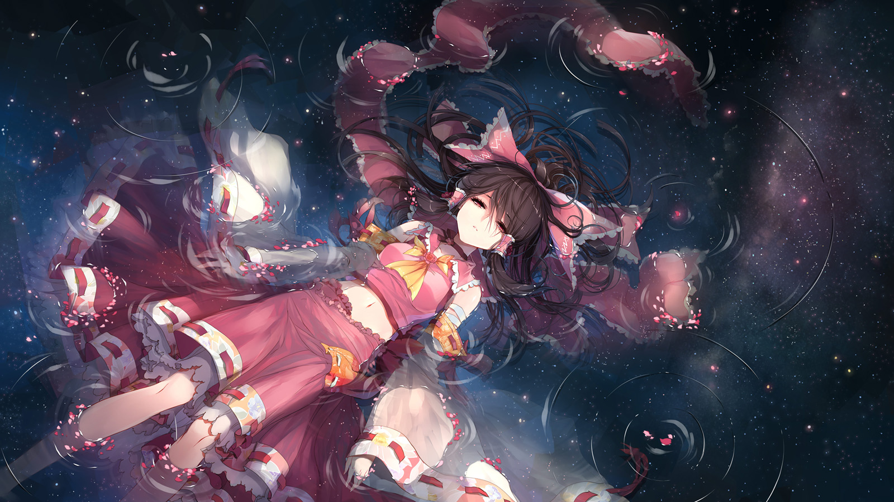
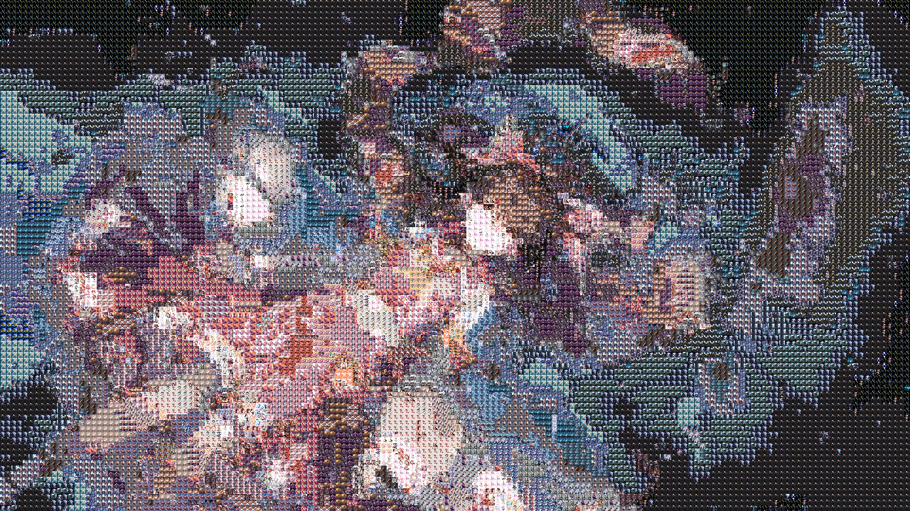
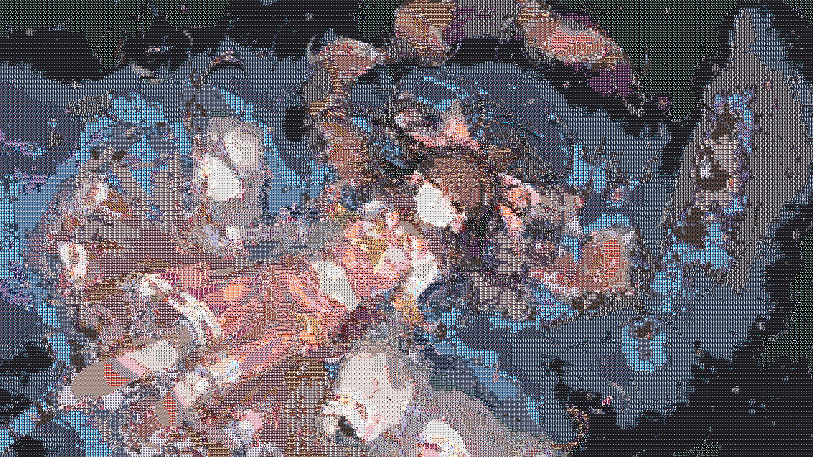
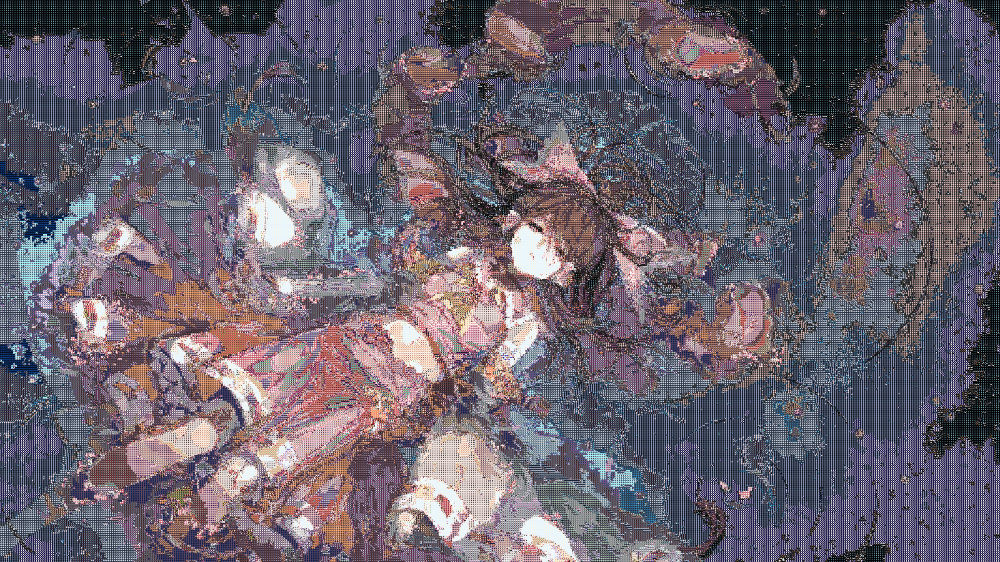
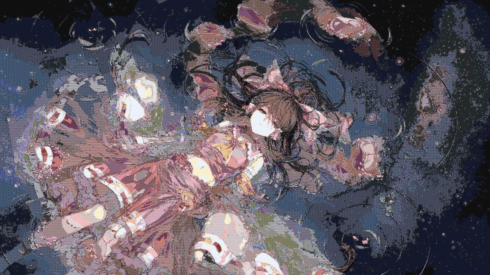
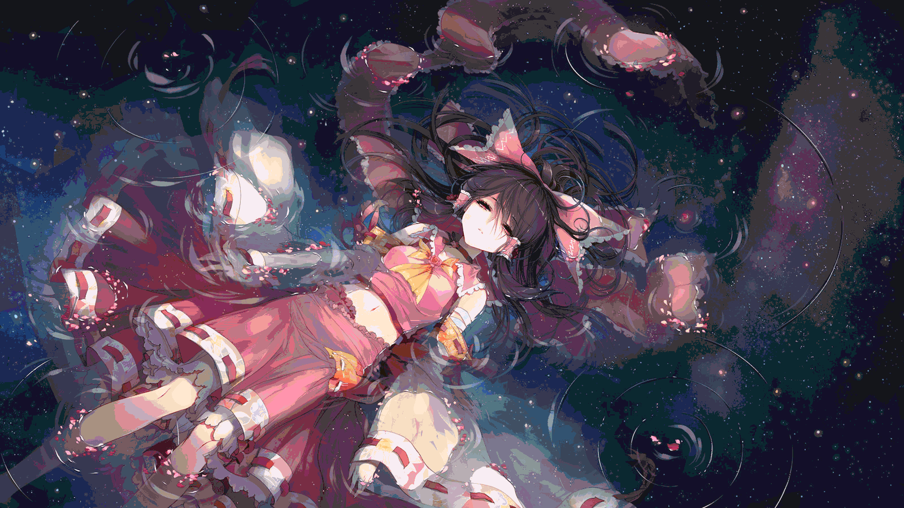

# Photomosaic Generator
Generate [Photomosaic](https://wikipedia.org/wiki/Photographic_mosaic) by histogram similarity and OpenMP.

## Download
[Releases](https://github.com/Chaoses-Ib/Photomosaic-generator/releases)

## Usage
```
Allowed options:
  --help                produce help message
  -I [ --images ] arg   * directory of the source images
  -n arg                limit the maximum number of source images
  -t [ --target ] arg   * target image
  --xn arg (=100)       number of x blocks
  --yn arg (=150)       number of y blocks
  --precision arg (=8)  histogram size
  --threads arg         number of threads for generating Photomosaic (0 for serial)
  -o [ --output ] arg   output path
```

## Preview
Original image ([source](https://www.pixiv.net/artworks/34844544)):


Generated Photomosaics:
- 160\*90p  
  
- 320\*180p  
  
- 533\*300p  
  
- 800\*450p  
  
- 1600\*900p  
  
